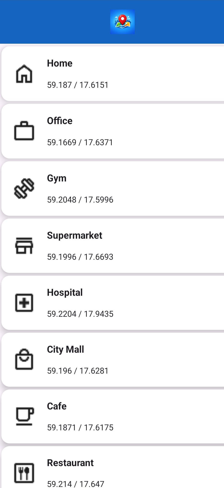
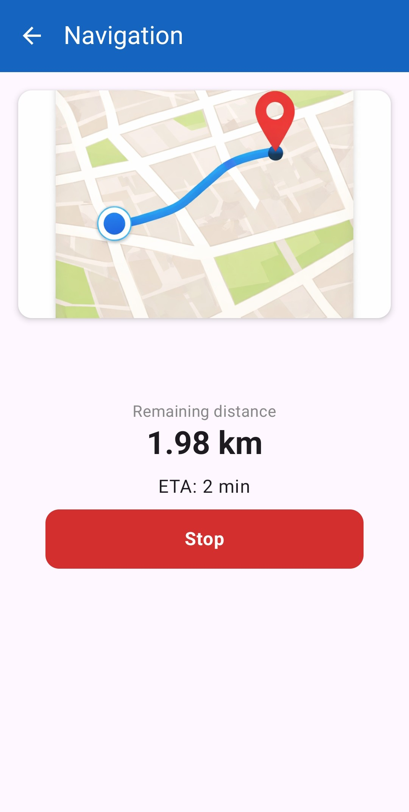

# MiniNavigationApp
A simple navigation android application built with Jetpack Compose that displays a list of places, shows place details, and simulates navigation without using any real map SDK.
The goal of this project is to demonstrate UI state handling, navigation, and basic simulation logic.

## **Features**
* Jetpack Compose Navigation: Navigate between screens using the Compose navigation component.

* Place List Screen: Displays a list of places.

* Detail Screen: Shows details for a selected place.

* Simulated Navigation: Emits mock location updates every second and displays remaining distance and ETA.

# **Tech Stack**

| Technology     | Version / Type                |
|----------------|--------------------------------|
| Language       | Kotlin                         |
| UI             | Jetpack Compose                |
| Navigation     | Navigation-Compose             |
| Architecture   | Clean Architecture + MVVM      |
| DI             | Hilt                           |
| Build Tool     | Gradle (Kotlin DSL)            |

## Architecture

This project follows **Clean Architecture with MVVM**.

- **UI Layer:** Jetpack Compose screens
- **ViewModel Layer:** Manages UI state and user actions
- **Domain Layer:** Use cases and core business logic
- **Data Layer:** Repository and mock data source

This structure keeps UI, logic, and data responsibilities clearly separated.

## How to run the app

1. Clone the repository: 
`git clone https://github.com/NishaMallick/MiniNavigationApp.git`

2. Open the project in Android Studio

3. Let Gradle sync complete

4. Run the app on an emulator or connected device

## Screenshots
| Place List                                      | Place Details                                            | Navigation UI                                         |
|-------------------------------------------------|----------------------------------------------------------|-------------------------------------------------------|
|  |  |  |

## Assumptions
* No real GPS, maps, or navigation SDKs are used
* Location coordinates, distance, and speed are mocked.
* Distance is calculated from predefined coordinates.
* The app is intended for learning and demonstration purposes.
